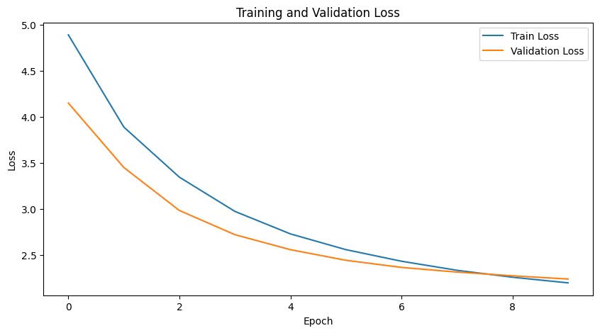

# [UET] BÁO CÁO MÔN HỌC NLP 2025 - INT3406 3

## Bài 1: Xây dựng mô hình dịch máy bằng Transformer (Code from scratch)
Bài toán: Xây dựng mô hình dịch máy Seq2Seq với kiến trúc Transformer

### A. Xử lý dữ liệu

Nhóm thực hiện quy trình thu thập, làm sạch và tiền xử lý dữ liệu theo yêu cầu chuẩn của bài toán dịch máy.

- **Bộ dữ liệu:** Nhóm sử dụng bộ dữ liệu IWSLT15 English-Vietnamese (IWSLT15 En-Vi). Đây là bộ dữ liệu chuẩn thường được sử dụng trong các nghiên cứu về dịch máy. [Link dataset](https://www.kaggle.com/datasets/tuannguyenvananh/iwslt15-englishvietnamese)

- **Thống kê dữ liệu:**
	- Train data: Gồm 133,166 cặp câu Tiếng Anh (train.en.txt) và Tiếng Việt (train.vi.txt)
	- Validation data: Trích xuất ngẫu nhiên 10% từ tập train gốc, tương đương 13,317 cặp câu để theo dõi quá trình huấn luyện và tránh hiện tượng overfitting. Tập train thực tế còn lại 119,849 cặp câu.
	- Test data: Gồm 2 bộ: **tst2012** (1,553 cặp câu) và **tst2013** (1268 cặp câu)

- **Tiền xử lý dữ liệu (Preprocessing Data):**
	- **Làm sạch (Cleaning):** Loại bỏ các ký tự nhiễu, chỉ giữ lại chữ cái và số, chuẩn hóa khoảng trắng.
	- **Chuẩn hóa văn bản:** Chuyển toàn bộ văn bản về dạng chữ thường (lowercase) để giảm kích thước từ điển mà vẫn giữ được ngữ nghĩa cơ bản.

- **Tokenization:** Sử dụng phương pháp tách từ dựa trên từ đơn (word-level tokenization) cho base line.

- **Xây dựng vocabulary:**
	- Thêm 4 token đặc biệt: `<pad>` (0), `<sos>` (1), `<eos>` (2), `<unk>` (3).
	- Ngưỡng tần suất (min_freq): 2 (loại bỏ các từ chỉ xuất hiện 1 lần để giảm nhiễu bằng cách chuyển thành `<unk>`).
	- **Kích thước từ điển:**
		- Tiếng Anh (Source): 26690 từ.
		- Tiếng Việt (Target): 11278 từ.
- **Padding & Truncation:**
	- Áp dụng kỹ thuật Dynamic Padding trong DataLoader: Thay vì đệm (pad) toàn bộ dữ liệu theo độ dài cố định, nhóm thực hiện đệm theo độ dài của câu dài nhất trong từng batch. Điều này giúp giảm đáng kể chi phí tính toán cho các token `<pad>`.
	- Giới hạn độ dài câu tối đa (MAX_LEN) là 100 token.

- **Code xây dựng vocabulary:**
```python
class Vocabulary:
    def __init__(self):
        self.stoi = {'<pad>': 0, '<sos>': 1, '<eos>': 2, '<unk>': 3}
        self.itos = {0: '<pad>', 1: '<sos>', 2: '<eos>', 3: '<unk>'}
        self.freq_threshold = 2

    def tokenizer(self, text):
        text = text.lower().strip()
        return re.findall(r"\w+|[^\w\s]", text)

    def build_vocabulary(self, sentence_list):
        frequencies = Counter()
        idx = 4
        for sentence in sentence_list:
            for word in self.tokenizer(sentence):
                frequencies[word] += 1
                if frequencies[word] == self.freq_threshold:
                    self.stoi[word] = idx
                    self.itos[idx] = word
                    idx += 1

    def numericalize(self, text):
        tokenized_text = self.tokenizer(text)
        return [self.stoi.get(token, self.stoi['<unk>']) for token in tokenized_text]
```

### B. Xây dựng kiến trúc Transformer


- **Transformer Embedding (Input/Output Embedding & Positional Encoding):**
	- **Input Embedding:** Chuyển đổi các token (dạng one-hot index) thành các vector dày đặc (dense vectors) có kích thước $$d_{model}$$. Vector này được nhân với $$\sqrt{d_{model}}$$ để chuẩn hoá.
	- **Positional Encoding:** Do kiến trúc Transformer xử lý song song và không có tính tuần tự (recurrence) như RNN, mô hình không tự nhận biết được thứ tự từ. Nên cần có Positional Encoding, nhóm sử dụng PE dạng hình sin (Sinusoidal) để cộng thông tin vị trí vào vector embedding.
	- **Code:**
	```python
	class TransformerEmbedding(nn.Module):
		def __init__(self, vocab_size, d_model, max_len=5000, drop_prob=0.1):
			super().__init__()
			self.d_model = d_model

			# Input/Output Embedding
			self.tok_emb = nn.Embedding(vocab_size, d_model)

			# Positional Encoding
			pe = torch.zeros(max_len, d_model)
			position = torch.arange(0, max_len, dtype=torch.float).unsqueeze(1)
			div_term = torch.exp(torch.arange(0, d_model, 2).float() * (-math.log(10000.0) / d_model))

			# Sin PE
			pe[:, 0::2] = torch.sin(position * div_term)
			pe[:, 1::2] = torch.cos(position * div_term)

			self.register_buffer('pe', pe.unsqueeze(0)) # no update gradient
			self.dropout = nn.Dropout(p=drop_prob)

		def forward(self, x):
			# x: (Batch, Seq_Len)
			token_emb = self.tok_emb(x) * math.sqrt(self.d_model)
			# 2. Add PE
			pos_emb = self.pe[:, :x.size(1), :]
			return self.dropout(token_emb + pos_emb)
	```

- **Multihead attention:**
Đây là thành phần cốt lõi của Transformer, cho phép mô hình tập trung vào các phần khác nhau của câu đầu vào.
	- **Scaled Dot-Product Attention:** Tính toán độ tương đồng giữa Query ($$Q$$) và Key ($$K$$), sau đó chuẩn hóa bằng Softmax và nhân với Value ($$V$$).

	- $$Attention(Q, K, V) = \text{softmax}(\frac{QK^T}{\sqrt{d_k}})V$$

  	- Sau đó chia cho $\sqrt{d_k}$ để tránh hiện tượng gradient vanishing.
	
	- **Multi-Head:** Chia vector đặc trưng thành $h$ đầu (heads) riêng biệt để mô hình có thể học được nhiều không gian biểu diễn ngữ nghĩa khác nhau song song.
	
	- **Code:**
	```python
	class MultiHeadAttention(nn.Module):
		def __init__(self, d_model, n_head):
			super().__init__()
			self.n_head = n_head
			self.head_dim = d_model // n_head
			self.d_model = d_model

			# Q, K, V
			self.w_q = nn.Linear(d_model, d_model)
			self.w_k = nn.Linear(d_model, d_model)
			self.w_v = nn.Linear(d_model, d_model)

			# Linear
			self.fc_out = nn.Linear(d_model, d_model)

		def forward(self, q, k, v, mask=None):
			# q, k, v: (Batch, Seq_Len, d_model)
			batch_size = q.size(0)

			# 1. Linear Project & Split Heads
			# d_model -> n_head x head_dim
			Q = self.w_q(q).view(batch_size, -1, self.n_head, self.head_dim).permute(0, 2, 1, 3)
			K = self.w_k(k).view(batch_size, -1, self.n_head, self.head_dim).permute(0, 2, 1, 3)
			V = self.w_v(v).view(batch_size, -1, self.n_head, self.head_dim).permute(0, 2, 1, 3)

			# 2. Scaled Dot-Product Attention
			# Energy: Q * K^T / sqrt(head_dim)
			energy = torch.matmul(Q, K.transpose(-2, -1)) / math.sqrt(self.head_dim)

			# 3. Apply Mask
			if mask is not None:
				energy = energy.masked_fill(mask == 0, -1e9)

			# 4. Softmax & Weighted Sum
			attention = torch.softmax(energy, dim=-1)
			x = torch.matmul(attention, V) # (Batch, n_head, Seq_Len, head_dim)

			# 5. Concat Heads & Final Linear
			x = x.permute(0, 2, 1, 3).contiguous().view(batch_size, -1, self.d_model)
			return self.fc_out(x)
	```

- **Position-wise Feed-Forward Network (FFN):**
	- Mỗi vị trí trong câu đi qua một mạng nơ-ron truyền thẳng giống nhau bao gồm hai lớp biến đổi tuyến tính và một hàm kích hoạt ReLU ở giữa.

	- $$FFN(x) = \text{max}(0, xW_1 + b_1)W_2 + b_2$$

	- **Code:**
	```python
	class PositionwiseFeedForward(nn.Module):
		def __init__(self, d_model, d_ff, dropout=0.1):
			super().__init__()
			# Linear -> ReLU -> Linear
			self.fc1 = nn.Linear(d_model, d_ff)
			self.fc2 = nn.Linear(d_ff, d_model)
			self.dropout = nn.Dropout(dropout)
			self.relu = nn.ReLU()

		def forward(self, x):
			return self.fc2(self.dropout(self.relu(self.fc1(x))))
	```

- **Encoder Layer:**
Encoder bao gồm $$N$$ lớp xếp chồng lên nhau. Mỗi lớp có hai khối con:
	- **Multi-Head Self-Attention:** là Multi-Head attention nhưng Q,K,V đến từ cùng 1 nguồn.
	- **Position-wise Feed-Forward:** Xung quanh mỗi khối con, có kết nối tắt (Residual Connection) và chuẩn hóa lớp (Layer Normalization): $LayerNorm(x + Sublayer(x))$.
	- **Code:**
	```python
	class EncoderLayer(nn.Module):
		def __init__(self, d_model, n_head, d_ff, dropout):
			super().__init__()
			# Sub-layer 1: Self Attention
			self.self_attn = MultiHeadAttention(d_model, n_head)
			self.norm1 = nn.LayerNorm(d_model) # Add & Norm

			# Sub-layer 2: Feed Forward
			self.ffn = PositionwiseFeedForward(d_model, d_ff, dropout)
			self.norm2 = nn.LayerNorm(d_model) # Add & Norm

			self.dropout = nn.Dropout(dropout)

		def forward(self, src, src_mask):
			# 1. Self-Attention: Multi-Head attention with all Q,K,V from src
			_src = self.self_attn(src, src, src, src_mask)

			# Add & Norm (Residual)
			src = self.norm1(src + self.dropout(_src))

			# 2. Feed Forward
			_src = self.ffn(src)

			# Add & Norm
			src = self.norm2(src + self.dropout(_src))
			return src
	```

- **Decoder Layer:**
Decoder cũng gồm $N$ lớp, nhưng mỗi lớp có thêm một khối cross-attention để nhìn vào Encoder:
	- **Masked Multi-Head Self-Attention:** Đảm bảo vị trí $i$ chỉ có thể chú ý đến các vị trí trước nó ($<i$). Sử dụng mask tam giác dưới để thực hiện điều này (Look-ahead mask).
	- **Multi-Head Cross-Attention:** Query ($Q$) lấy từ lớp Decoder trước đó, trong khi Key ($K$) và Value ($V$) lấy từ đầu ra của Encoder. Khối này giúp Decoder "nhìn" vào câu nguồn để dịch
	- **Feed-Forward Network**.
	- **Code:**
	```python
	class DecoderLayer(nn.Module):
		def __init__(self, d_model, n_head, d_ff, dropout):
			super().__init__()

			# Sub-layer 1: Masked Self-Attention
			self.self_attn = MultiHeadAttention(d_model, n_head)
			self.norm1 = nn.LayerNorm(d_model)

			# Sub-layer 2: Cross-Attention
			self.cross_attn = MultiHeadAttention(d_model, n_head)
			self.norm2 = nn.LayerNorm(d_model)

			# Sub-layer 3: Feed Forward
			self.ffn = PositionwiseFeedForward(d_model, d_ff, dropout)
			self.norm3 = nn.LayerNorm(d_model)

			self.dropout = nn.Dropout(dropout)

		def forward(self, trg, enc_src, trg_mask, src_mask):
			# 1. Masked Self-Attention
			# Q, K, V from src. Mask: future mask
			_trg = self.self_attn(trg, trg, trg, trg_mask)
			trg = self.norm1(trg + self.dropout(_trg))

			# 2. Cross-Attention (Encoder-Decoder Attention)
			# Q: target (Decoder), K,V: source (Encoder)
			_trg = self.cross_attn(trg, enc_src, enc_src, src_mask)
			trg = self.norm2(trg + self.dropout(_trg))

			# 3. Feed Forward
			_trg = self.ffn(trg)
			trg = self.norm3(trg + self.dropout(_trg))

			return trg
	```

- **Transformer:**
Ghép nối Encoder và Decoder, thêm lớp Linear cuối cùng và hàm Softmax để dự đoán xác suất của từ tiếp theo trong từ điển đích.
	- Code:
	```python
	class Transformer(nn.Module):
		def __init__(
			self,
			src_vocab_size, trg_vocab_size,
			src_pad_idx, trg_pad_idx,
			d_model=512, n_head=8, n_layer=6, d_ff=2048,
			dropout=0.1, device="cuda"
		):
			super().__init__()
			self.device = device
			self.src_pad_idx = src_pad_idx
			self.trg_pad_idx = trg_pad_idx

			# 1. Input Embeddings & Positional Encoding
			self.src_embedding = TransformerEmbedding(src_vocab_size, d_model, drop_prob=dropout)
			self.trg_embedding = TransformerEmbedding(trg_vocab_size, d_model, drop_prob=dropout)

			# 2. Encoder (Nx)
			self.encoder_layers = nn.ModuleList([
				EncoderLayer(d_model, n_head, d_ff, dropout) for _ in range(n_layer)
			])

			# 3. Decoder (Nx)
			self.decoder_layers = nn.ModuleList([
				DecoderLayer(d_model, n_head, d_ff, dropout) for _ in range(n_layer)
			])

			# 4. Linear & Softmax
			# PyTorch CrossEntropyLoss included Softmax
			self.fc_out = nn.Linear(d_model, trg_vocab_size)

		def make_src_mask(self, src):
			# padding mask
			# Shape: (Batch, 1, 1, Src_Len)
			return (src != self.src_pad_idx).unsqueeze(1).unsqueeze(2).to(self.device)

		def make_trg_mask(self, trg):
			# padding mask
			trg_pad_mask = (trg != self.trg_pad_idx).unsqueeze(1).unsqueeze(2)

			# future mask
			trg_len = trg.shape[1]
			trg_sub_mask = torch.tril(torch.ones((trg_len, trg_len), device=self.device)).bool()

			return (trg_pad_mask & trg_sub_mask).to(self.device)

		def forward(self, src, trg):
			# src: (Batch, Src_Len) -> Inputs
			# trg: (Batch, Trg_Len) -> Outputs (shifted right)

			src_mask = self.make_src_mask(src)
			trg_mask = self.make_trg_mask(trg)

			# --- Encoder Flow ---
			# 1. Input -> Embedding + Positional Encoding
			enc_src = self.src_embedding(src)

			# 2. Nx Encoder
			for layer in self.encoder_layers:
				enc_src = layer(enc_src, src_mask)

			# --- Decoder Flow ---
			# 3. Output (shifted) -> Embedding + Positional Encoding
			output = self.trg_embedding(trg)

			# 4. Nx Decoder
			for layer in self.decoder_layers:
				output = layer(output, enc_src, trg_mask, src_mask)

			# 5. Output Probabilities
			return self.fc_out(output)
	```

### C. Training
Nhóm thiết lập quy trình huấn luyện với các hyperparameters và hàm loss tiêu chuẩn.
1. **Hyper-parameters:** Do tập dữ liệu IWSLT khá nhỏ (~130k câu) so với các tập dữ liệu lớn như WMT, nhóm chọn kích thước mô hình (Small Transformer) để đảm bảo mô hình hội tụ nhanh và tránh overfitting, đồng thời tiết kiệm tài nguyên tính toán.
```python
BATCH_SIZE = 16        # Kích thước batch phù hợp với GPU T4 (Colab)
D_MODEL = 256          # Kích thước vector ẩn (Giảm từ 512 để phù hợp dataset nhỏ)
N_HEAD = 4             # Số lượng attention heads
N_LAYER = 4            # Số lớp Encoder/Decoder
D_FF = 1024            # Kích thước ẩn của lớp FFN (4 * d_model)
DROPOUT = 0.1          # Hệ số dropout để tránh overfitting
EPOCHS = 10            # Số vòng lặp huấn luyện
LEARNING_RATE = 0.0001 # Tốc độ học khởi tạo
MAX_LEN = 100          # Độ dài câu tối đa
DEVICE = torch.device('cuda' if torch.cuda.is_available() else 'cpu')
```

2. **Khởi tạo và Loss Function:**
	- Khởi tạo trọng số: Sử dụng phân phối Xavier Uniform (nn.init.xavier_uniform_) giúp quá trình huấn luyện ổn định hơn.
	- Optimizer: Sử dụng Adam Optimizer.
	- Loss Function: Sử dụng CrossEntropyLoss với ignore_index=PAD_IDX để mô hình không tính lỗi cho các padding token.
   	- Code:
	```python
	# --- Model ---
	model = Transformer(
		src_vocab_size=len(src_vocab.stoi),
		trg_vocab_size=len(trg_vocab.stoi),
		src_pad_idx=0,
		trg_pad_idx=0,
		d_model=D_MODEL,
		n_head=N_HEAD,
		n_layer=N_LAYER,
		d_ff=D_FF,
		dropout=DROPOUT,
		device=DEVICE
	).to(DEVICE)

	# --- Weights ---
	# Xavier Initialization
	def initialize_weights(m):
		if hasattr(m, 'weight') and m.weight.dim() > 1:
			nn.init.xavier_uniform_(m.weight.data)
	model.apply(initialize_weights)

	# --- Optimizer & Scheduler ---
	optimizer = optim.Adam(model.parameters(), lr=LEARNING_RATE, betas=(0.9, 0.98), eps=1e-9)

	# Loss Function
	# ignore_index=0 ignore loss <pad> token
	criterion = nn.CrossEntropyLoss(ignore_index=0)
	```

3. **Training Loop:**
Nhóm thực hiện vòng lặp huấn luyện, theo dõi Loss trên tập Train và Validation sau mỗi epoch.
```python
for epoch in range(EPOCHS):
    start_time = time.time()

    train_loss = train_epoch(model, train_loader, optimizer, criterion, CLIP)
    valid_loss = evaluate(model, valid_loader, criterion)

    end_time = time.time()
    epoch_mins, epoch_secs = divmod(end_time - start_time, 60)

    train_losses.append(train_loss)
    valid_losses.append(valid_loss)
    train_ppls.append(math.exp(train_loss))
    valid_ppls.append(math.exp(valid_loss))

    if valid_loss < best_valid_loss:
        best_valid_loss = valid_loss
        torch.save(model.state_dict(), 'transformer-model.pt')
        print(f"Saved Model (Val Loss: {valid_loss:.3f})")

    print(f'Epoch: {epoch+1:02} | Time: {int(epoch_mins)}m {int(epoch_secs)}s')
    print(f'\tTrain Loss: {train_loss:.3f} | Train PPL: {math.exp(train_loss):7.3f}')
    print(f'\t Val. Loss: {valid_loss:.3f} |  Val. PPL: {math.exp(valid_loss):7.3f}')
```
- Đồ thị Loss: 
- Nhận xét: Loss giảm đều từ 4.90 xuống 2.21 sau 10 epochs, chứng tỏ mô hình đang học tốt.

### D. Testing - Evaluation
Nhóm sử dụng hai phương pháp đánh giá trên tập Test:
- BLEU score: BLEU Score (Bilingual Evaluation Understudy): Độ đo tiêu chuẩn đánh giá sự trùng khớp n-grams giữa câu máy dịch và câu tham chiếu.
- Gemini Score: Sử dụng LLM (gemini-2.5-flash) làm giám khảo để chấm điểm chất lượng bản dịch dựa trên thang điểm 1-100 về độ trôi chảy và chính xác ngữ nghĩa.

### E. Tối ưu
- Sử dụng Beam Search: Thay vì Greedy tại mỗi bước chọn từ có xác suất cao nhất, Beam Search duy trì $k$ (beam width) ứng viên tốt nhất tại mỗi bước để tìm ra chuỗi từ tối ưu toàn cục.
- Tối ưu tokenizer: Thử nghiệm thay thế tách từ đơn giản bằng BPE (Byte Pair Encoding) để xử lý tốt hơn các từ hiếm (OOV) và giảm kích thước từ điển.

### D. Kết quả cuối cùng

Bảng BLEU score và Gemini Score cho các phương pháp (Task 1 – IWLST-15 En–Vi):

| Phương pháp              | BLEU Score | Gemini Score |
| ------------------------ | ---------: | -----------: |
| Basic                    |      24.61 |        65.75 |
| Beam Search (k=3)        |      25.13 |        67.10 |
| Word seg + BPE tokenizer |      25.36 |        67.72 |